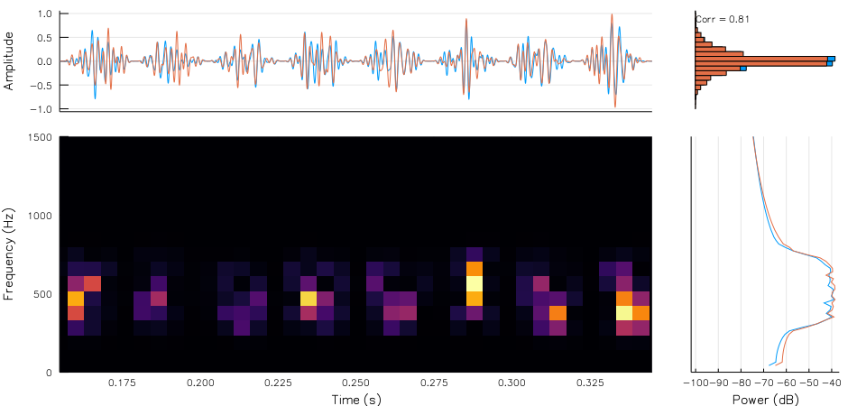
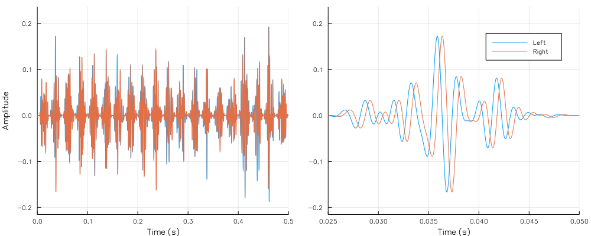

# AuditoryStimuli

[](https://travis-ci.org/rob-luke/AuditoryStimuli.jl)
[](http://codecov.io/github/rob-luke/AuditoryStimuli.jl?branch=master)

Generate common auditory stimuli. Built on top of [SampledSignals](https://github.com/JuliaAudio/SampledSignals.jl), [Unitful](https://github.com/ajkeller34/Unitful.jl), and [Plots](https://github.com/JuliaPlots/Plots.jl).

## Installation

```julia
] dev https://github.com/rob-luke/AuditoryStimuli.jl.git
```


## Coming soon

Examples from research papers


## Example


```julia
time = 0:1/48000:0.5
cn = correlated_noise(length(time), 2, 0.8)
bn = bandpass_noise(cn, 300, 700, 48000)
an = set_RMS(amplitude_modulate(bn, 40, 48000), 0.2)
PlotSpectralTemporal(an, 48000, time_limits = [0.155, 0.345])
```




```julia
time = 0:1/48000:1
cn = correlated_noise(length(time), 2, 1)
bn = bandpass_noise(cn, 300, 700, 48000)
an = amplitude_modulate(bn, 40, 48000)
it = set_ITD(an, -24)

a = plot(time, im, lab = "", xlab = "Time (s)", ylab = "Amplitude", xlims = (0.0, 0.5))
b = plot(time, im, lab = map(string,[:Left :Right]), xlab = "Time (s)", ylab = "", xlims = (0.025, 0.05))
plot(a, b, size = (1000, 400))
```


